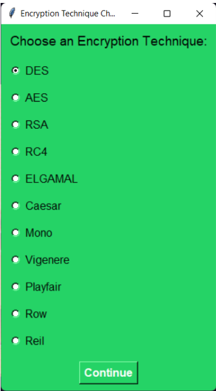

# End-To-End-Chatting-App
applying encryption and decryption techniques for example: (DES, AES, RSA, RC4, ElGamal, CAESAR, MONO, VIGENERE, PLAYFAIR, ROW, REIL)

the user chooses the encryption technique  

then the user1 send message to user2. the message is encrypted and decrypted 

